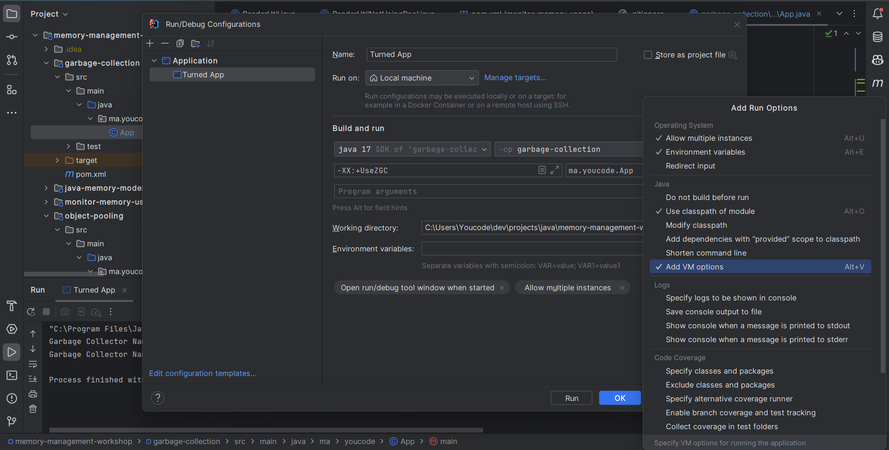

### how to add VM options in IntelliJ IDEA
> 1. open the `Run/Debug Configurations` dialog box
> 2. select the configuration to change
> 3. click the `Modify options` button
> 4. select `Add VM options`
> 5. enter the VM options

