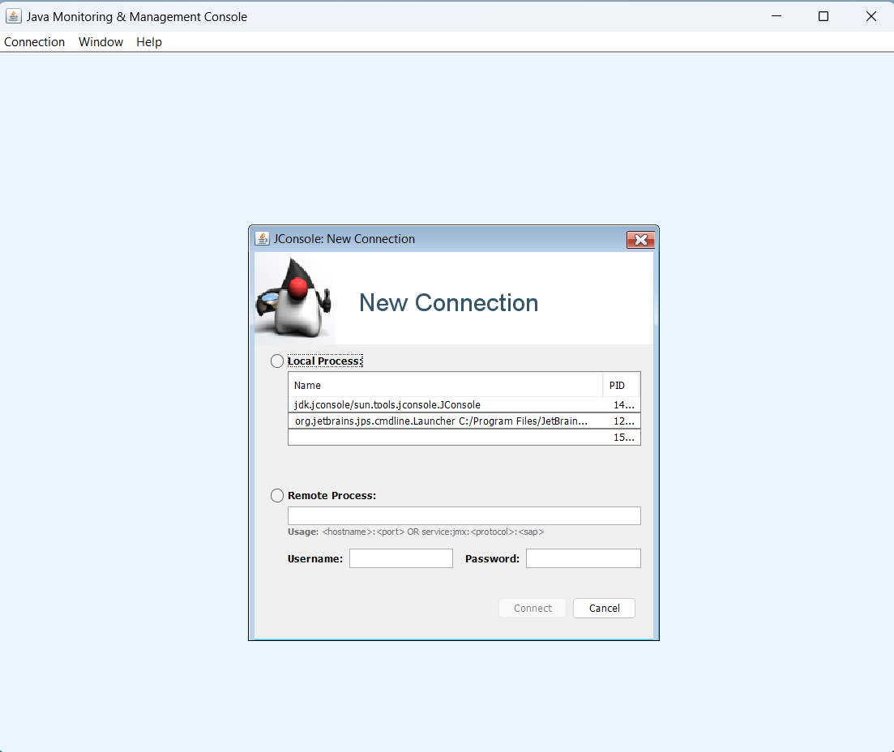

### Monitor Memory Usage

the jdk comes with a tool called jconsole that can be used to monitor memory usage of a java application. 

>jconsole can connect to a running java application and display information about the memory usage of the application while it is running. jconsole can also be used to take heap dumps of the java application. a heap dump is a snapshot of the memory usage of the java application at a given point in time. the heap dump can be analyzed to find memory leaks in the java application.

### what jconsole can do ?

-  can connect to a running java application and display information about the memory usage of the application while it is running.
-  used to take **_`heap dumps`_** of the java application. a heap dump is a snapshot of the memory usage of the java application at a given point in time. the heap dump can be analyzed to find memory leaks in the java application.
-  used to take **_`thread dumps`_** of the java application. a thread dump is a snapshot of the state of all threads in the java application at a given point in time. the thread dump can be analyzed to find deadlocks in the java application.
-  used to monitor the **_`cpu usage`_** of the java application.
-  used to monitor the number of **_`classes loaded`_** by the java application.
-  used to monitor the number of _**`threads running`**_ in the java application.

### other tools for monitoring memory usage

-  ### **_`visualvm`_** :

is a tool that can be used to monitor memory usage of a java application. visualvm can connect to a running java application and display information about the memory usage of the application while it is running. 
- ### **_`The Eclipse Memory Analyzer™`_** : 

provides a general purpose toolkit to analyze Java heap dumps. Besides heap walking and fast calculation of retained sizes, the Eclipse tool reports leak suspects and memory consumption anti-patterns. The main area of application are Out Of Memory Errors and high memory consumption.

